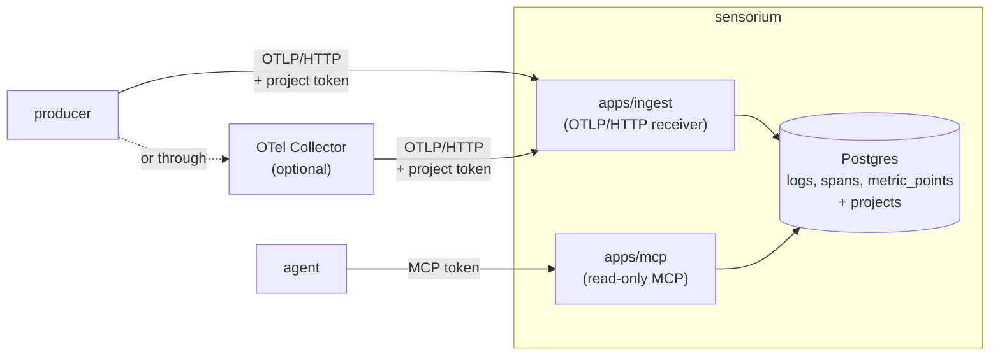

```
███████╗███████╗███╗   ██╗███████╗ ██████╗ ██████╗ ██╗██╗   ██╗███╗   ███╗
██╔════╝██╔════╝████╗  ██║██╔════╝██╔═══██╗██╔══██╗██║██║   ██║████╗ ████║
███████╗█████╗  ██╔██╗ ██║███████╗██║   ██║██████╔╝██║██║   ██║██╔████╔██║
╚════██║██╔══╝  ██║╚██╗██║╚════██║██║   ██║██╔══██╗██║██║   ██║██║╚██╔╝██║
███████║███████╗██║ ╚████║███████║╚██████╔╝██║  ██║██║╚██████╔╝██║ ╚═╝ ██║
╚══════╝╚══════╝╚═╝  ╚═══╝╚══════╝ ╚═════╝ ╚═╝  ╚═╝╚═╝ ╚═════╝ ╚═╝     ╚═╝
```

# sensorium

> Observability for agents: OpenTelemetry in, MCP out.

`opentelemetry` · `mcp` · `postgres` · `docker` · `bun`

[](https://github.com/zyx1121/sensorium/actions) &nbsp;[](https://github.com/zyx1121/sensorium/pkgs/container/sensorium) &nbsp;[](#license)

Your services already speak OpenTelemetry, but the one reading their logs at
3 am is increasingly an agent, not a person with a dashboard. sensorium keeps
the logs, traces and metrics of many services in one Postgres store and hands
them to agents over MCP, so the question "what broke?" goes to a tool call.

```
> "is anything failing on www-zyx today?"
  ⚡ error_summary { project: "www-zyx", windowMinutes: 1440 }
✓ 0 error logs, 24 error spans in the last 24 hours
```

## What it does

- **Ingests OpenTelemetry**: OTLP over HTTP, as JSON or protobuf, at `/v1/logs`, `/v1/traces` and `/v1/metrics`.
- **Keeps projects apart**: each project has its own ingest token, and the token decides where its records land.
- **Answers agents**: eight read-only MCP tools at `/mcp`: `list_projects`, `query_logs`, `query_traces`, `list_traces`, `error_summary`, `top_sources`, `query_metrics` and `search`.
- **Expires data by itself**: metrics after 14 days, spans and logs after 30, by default.

## Deploy

With Docker Compose, on any machine with Docker:

```sh
curl -fsSLO https://raw.githubusercontent.com/zyx1121/sensorium/main/compose.yaml
curl -fsSL -o .env https://raw.githubusercontent.com/zyx1121/sensorium/main/.env.example
# set POSTGRES_PASSWORD and SENSORIUM_MCP_TOKEN in .env, e.g. with `openssl rand -hex 32`
docker compose up -d
```

That starts Postgres, applies the schema, and runs the receiver on port 8787,
the MCP endpoint on port 8788 and a retention sweep every 24 hours, all from
the image `ghcr.io/zyx1121/sensorium`.

> [!IMPORTANT]
> Both ports listen on 127.0.0.1, and tokens travel in the Authorization
> header. Put a reverse proxy with TLS in front of them (Caddy, nginx) before
> anything outside the machine talks to sensorium.

Without Docker, [deploy/](deploy/) has systemd units for a checkout with Bun
and a local Postgres.

## Use

1. Register a project. The token is printed once; running it again for the
   same name rotates it.

   ```sh
   docker compose run --rm ingest register-project my-service
   ```

2. Point the service's OpenTelemetry exporter at sensorium:

   ```sh
   OTEL_EXPORTER_OTLP_ENDPOINT=https://sensorium.example.com
   OTEL_EXPORTER_OTLP_PROTOCOL=http/protobuf
   OTEL_EXPORTER_OTLP_HEADERS=Authorization=Bearer%20<ingest token>
   ```

   sensorium takes neither gzip nor gRPC. For an exporter that only speaks
   those, put an OpenTelemetry Collector in front, as in
   [collector/](collector/), with `compression: none` on its otlphttp exporter.

3. Connect an agent to the MCP endpoint:

   ```sh
   claude mcp add --transport http sensorium https://sensorium.example.com/mcp \
     --header "Authorization: Bearer <SENSORIUM_MCP_TOKEN>"
   ```

4. Ask it what broke. `error_summary` and `top_sources` are the usual first
   calls.

## Configure

Set these in `.env`; [.env.example](.env.example) documents every one.

| Key | What it sets | Default |
|-----|--------------|---------|
| `POSTGRES_PASSWORD` | The bundled Postgres password (Docker Compose) | required |
| `SENSORIUM_MCP_TOKEN` | The bearer token every agent sends to `/mcp` | required |
| `SENSORIUM_VERSION` | The image tag compose.yaml runs | `latest` |
| `SENSORIUM_BIND` | The address the two ports listen on | `127.0.0.1` |
| `SENSORIUM_INGEST_PORT`, `SENSORIUM_MCP_PORT` | The published ports | `8787`, `8788` |
| `SENSORIUM_RETENTION_METRIC_DAYS` | Days of metrics to keep | `14` |
| `SENSORIUM_RETENTION_SPAN_DAYS`, `SENSORIUM_RETENTION_LOG_DAYS` | Days of spans and of logs to keep | `30` |
| `SENSORIUM_RETENTION_AHEAD_DAYS` | Days of metric partitions created ahead | `7` |
| `DATABASE_URL`, `PORT`, `MCP_PORT` | Only for a run from source | |

Size the metric window against real throughput: one busy Proxmox host writes
about 2.4 GB of metrics a day, so 14 days is about 33 GB on disk.

## How it works



An ingest token is bound to one project when it is registered. The
`service.namespace` a producer claims is recorded but never trusted for
scoping: the token alone decides which project rows land in. The MCP endpoint
has one shared token for its trusted readers, and reads are cross-project.
`metric_points` is partitioned by UTC day, so expiring metrics drops whole
tables and returns the space at once.

## Develop

Requires Bun 1.3 and a Postgres reachable at `DATABASE_URL`, for example
`docker run -d -p 5432:5432 -e POSTGRES_PASSWORD=postgres postgres:16`.

```sh
bun install
cp .env.example .env   # set DATABASE_URL and SENSORIUM_MCP_TOKEN

bun run db:migrate                        # apply packages/db/migrations
bun run db:register-project my-project    # prints an ingest token, once

bun run --filter @sensorium/ingest dev    # :8787
bun run --filter @sensorium/mcp dev       # :8788
```

```sh
bun run typecheck   # tsc --noEmit across the workspace
bun run lint        # eslint, shared @sensorium/eslint-config
bun run test        # bun test; packages/db runs its integration tests when DATABASE_URL is set
```

```
apps/ingest/     OTLP/HTTP receiver: POST /v1/{logs,traces,metrics}, OTLP/JSON or OTLP/protobuf.
                 With SENSORIUM_LANDING=1 it also serves sensorium.zyx.tw's landing page at /.
apps/mcp/        MCP server over streamable HTTP, stateless, read-only.
packages/core/   Signal model and OTLP to row mapping (pure, unit tested), span-tree builder.
packages/db/     SQL migrations, the migration runner and CLI, query helpers shared by ingest and mcp.
collector/       OTel Collector config for producers that cannot export OTLP/HTTP directly.
bin/sensorium    The image's entry point: ingest, mcp, migrate, register-project, retention.
```

CI builds the image and runs [scripts/smoke.sh](scripts/smoke.sh) against a
real `docker compose up`: a project registers, a log goes in over OTLP and comes
back over MCP. Every push to main publishes `ghcr.io/zyx1121/sensorium:sha-<commit>`;
a `v*` tag publishes the SemVer tags and `latest`.

## Limitations

- Ingest accepts OTLP/HTTP with `Content-Type: application/json` or `application/x-protobuf`, uncompressed. Anything else gets a 415, and gzip bodies a 400.
- Histogram points store the aggregate `sum` as `value`, not buckets: fine for "is this moving", not for percentiles.
- No rate limits or payload size caps on ingest yet.
- `search` is `ILIKE`, not full-text search.
- `top_sources` reads `client.address`, `geo.*` and `http.route` straight out of the jsonb attributes, with no dedicated columns or indexes yet.
- `http_status_code` is set only on inbound spans (`kind = "server"`, or carrying `http.route`, `http.target` or `vercel.matched_path`), so a callee's status never pollutes `error_summary` or `top_sources`.

## Contributing

Issues and PRs welcome: start with [CONTRIBUTING.md](https://github.com/zyx1121/.github/blob/main/CONTRIBUTING.md).

## License

[MIT](LICENSE) · named for the part of the brain that receives everything the senses report.
