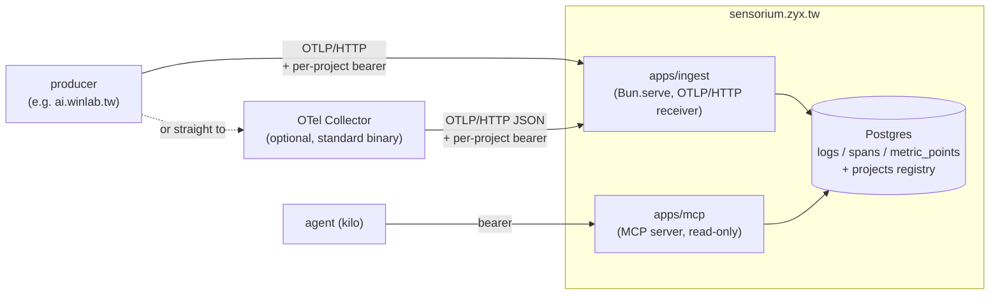

# sensorium

Agent-native observability. The consumer of this data is an agent doing
maintenance/analysis over MCP — not a human staring at a dashboard. Multiple
projects share one store, partitioned by OTel's native `service.namespace`.

## Architecture



`packages/core` maps OTLP/JSON → row shapes (pure functions, unit tested).
`packages/db` owns the Postgres schema, migrations, and query helpers shared
by ingest (writes) and mcp (reads). See `collector/README.md` for the two
supported ingest paths (Collector in front, vs. straight to `apps/ingest`).

**Auth model**: an ingest bearer token is bound 1:1 to a project at
registration time. The `service.namespace` a client claims in its OTLP
payload is recorded for reference but never trusted for scoping — the token
decides which project rows land in, full stop. The MCP endpoint has a single
shared bearer token (one trusted consumer); reads are cross-project.

## Workspace layout

```
apps/ingest/     OTLP/HTTP receiver — POST /v1/{logs,traces,metrics}, OTLP/JSON or OTLP/protobuf.
apps/mcp/        MCP server (streamable HTTP) — list_projects, query_logs, query_traces, list_traces, error_summary, top_sources, search.
packages/core/   Signal model + OTLP/JSON → row mapping (pure, unit tested) + span-tree builder.
packages/db/     SQL migrations, migration runner, query helpers shared by ingest/mcp.
collector/       OTel Collector config for producers that don't export OTLP/JSON directly.
```

## Local development

Requires a Postgres reachable via `DATABASE_URL` (either `docker run -d -p 5432:5432 -e POSTGRES_PASSWORD=postgres postgres:16`, or an existing local install).

```sh
bun install
cp .env.example .env   # fill in DATABASE_URL, SENSORIUM_MCP_TOKEN

bun run db:migrate                        # apply packages/db/migrations
bun run db:register-project my-project    # prints an ingest token, once

bun run --filter @sensorium/ingest dev    # :8787
bun run --filter @sensorium/mcp dev       # :8788
```

Send it something:

```sh
curl -X POST localhost:8787/v1/logs \
  -H "content-type: application/json" \
  -H "authorization: Bearer <token from db:register-project>" \
  -d '{"resourceLogs":[{"resource":{"attributes":[{"key":"service.name","value":{"stringValue":"demo"}}]},"scopeLogs":[{"logRecords":[{"timeUnixNano":"'"$(date +%s)"'000000000","severityText":"INFO","body":{"stringValue":"hello sensorium"}}]}]}]}'
```

## Commands

```sh
bun run build       # turbo build (packages: tsc; apps: bun build --target bun)
bun run typecheck    # turbo typecheck (tsc --noEmit) across the workspace
bun run test         # turbo test (bun test) — packages/core + apps/ingest are pure unit tests;
                     # packages/db has DATABASE_URL-gated integration tests (skipped, not failed, if unset)
bun run lint         # eslint . (flat config, shared @sensorium/eslint-config)
```

## v0 scope / known gaps

- Ingest accepts OTLP/**JSON** and OTLP/**protobuf** (`Content-Type:
  application/json` or `application/x-protobuf`); anything else gets a 415.
  See `collector/README.md`.
- Histogram metric points store the aggregate `sum` as `value`, not
  per-bucket data — fine for "is this moving", not for percentiles.
- No rate limiting / payload size caps on `apps/ingest` yet.
- `apps/mcp`'s `search` tool is `ILIKE`, not full-text search.
- `top_sources` unions spans and logs by `client.address` — some producers (e.g.
  Vercel) attach attribution to a log record (429/401) rather than the span. Its
  geo/route breakdown still reads `client.address`/`geo.*`/`http.route` straight out
  of `attributes` (jsonb) — no dedicated columns/indexes yet. Fine at v0 volume;
  revisit (generated columns + index) if it's slow at scale.
- `http_status_code` is only populated on spans classified as inbound (`kind =
  "server"`, or carrying `http.route`/`http.target`/`vercel.matched_path`) — outbound
  spans (this service's own `fetch()` calls) never get it, so a callee's status can't
  pollute `error_summary`/`top_sources`. See `isInboundSpan`/`isOutboundSpan` in
  `packages/core`.
